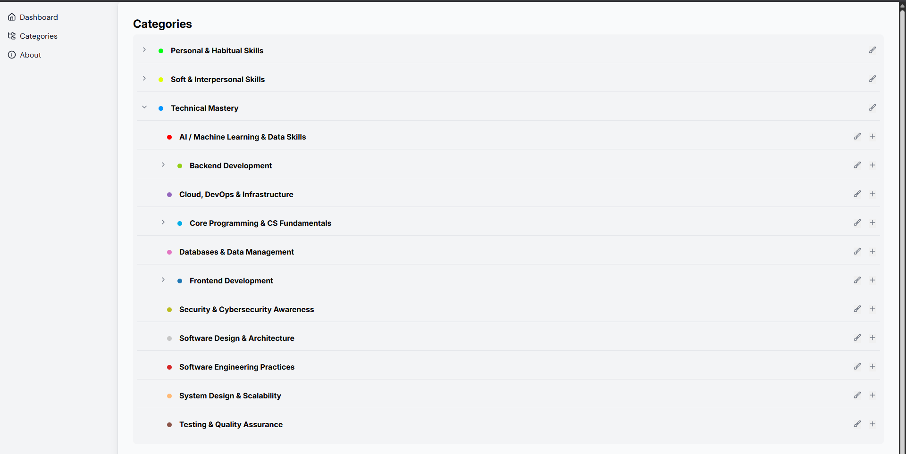

# Personal Knowledge Management App  

My project idea is to organize skills into structured categories. These categories represent different topics related to the field of software development.

The category structure is divided into three levels: main topic → subtopic → sub-subtopic (skill).

Below is a preview of some of the categories included in the system:

Users can only create and manage third-level topics (sub-subtopics), which represent specific skills they want to build or track over time.

For each skill, users can create lesson entries to record what they’ve learned. Each lesson represents new knowledge or an experience gained while developing that skill.

Over time, these lessons build up to show the user’s progress and growth within each skill.

The system integrates AI features that automatically classify lessons and categories within the correct structure. It also evaluates the user’s skill level based on lesson content and displays the resulting scores and progress on a personalized dashboard.

## Technology Used  

- **React**   
- **Vite**   
- **VS Code**    
- **GitHub**   

## Project Links  
- **[Backend Repo](https://github.com/MaherGarni/Personal-Knowledge-Management-Backend)**  
- **[Site link](http://localhost:5173/)**  
  
## Icebox Features  
- Enhance lesson creation UX and allow image uploads.

