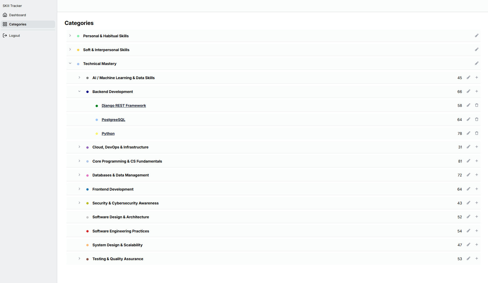
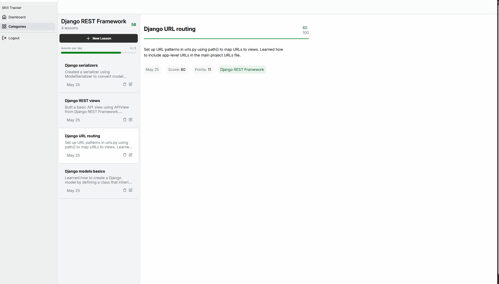
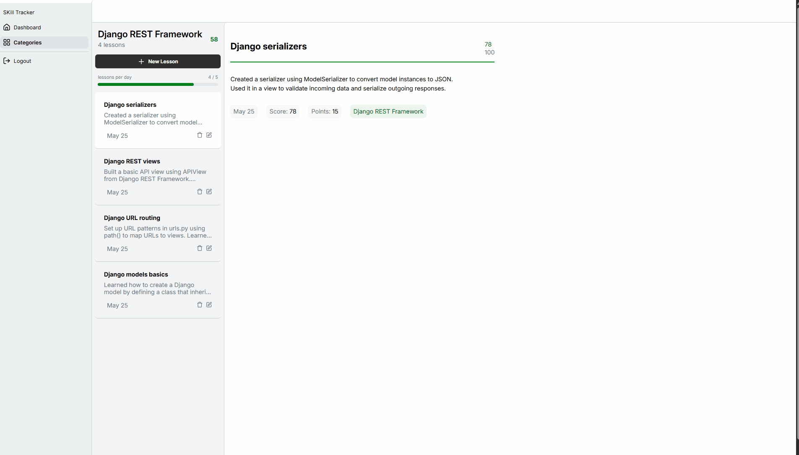
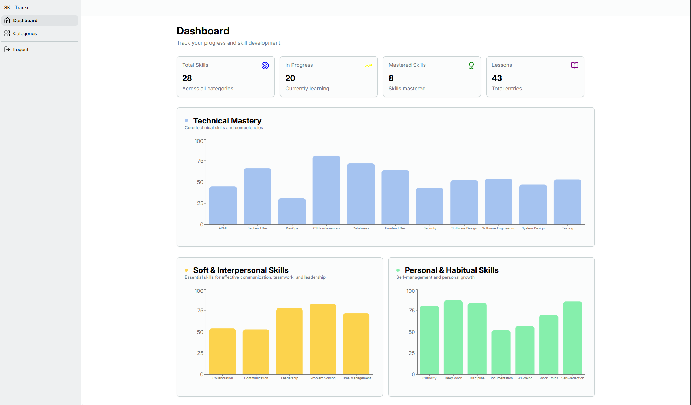

# PKM — Personal Knowledge Management  

A full-stack skill tracking app built as my capstone project for the SDA x General Assembly software development bootcamp.

## Overview 

### The Problem
Learning across multiple skills at once is messy. Topics pile up, progress is invisible, and there's no easy way to know how far you've actually come. I wanted a way to organize my learning that reflected real growth — not just a list of things I studied.

### The Solution
PKM lets users create skills they want to develop and record lessons as they learn. Each lesson is evaluated by AI — first checked for relevance to the chosen skill, then scored based on lesson quality and topic advancement. Those scores generate points that build the skill rating over time. The result is a dashboard that reflects where you actually stand across every skill you're working on.

## App Pages

PKM has three main pages: Categories, Skill Lessons, and Dashboard.
 
### Categories & Skills

The main page where users browse and create skills. Skills follow a three-level hierarchy: 
**Skill Domain → Skill Area → Skill**  
The top two levels are predefined. Users create skills at the third level under whichever area fits.

For example: *Technical Mastery → Backend Development → Django REST Framework*. A user tracking their backend progress would create skills like *Django REST Framework*, *PostgreSQL*, and *Python* under *Backend Development*.

The predefined structure ensures the AI has enough context to accurately judge how advanced each lesson is — a free-form skill name alone wouldn't provide enough signal for reliable scoring. It also keeps skills organized in a way that reflects how knowledge is actually structured in the real world.

Once a skill is created, clicking on it opens the Skill Lessons page.
 
 
### Skill Lessons
this page where user can see skill details, browse lessons created and create new lessons entries. Each lesson represents new knowledge or an experience gained while developing that skill. Over time, these lessons build up to show the user's progress and growth within each skill.

the page theme color is based on user's chosen color for the skill.

the layout of the page is split into two sections, side panel and lesson details section. 

side panel shows skill details — rating, lesson count, daily AI limit — and the list of recorded lessons. Clicking a lesson card opens it in the lesson detail section.

The lesson detail section displays the lesson title and content, along with AI evaluation data — lesson score and points earned.

- **lesson score** represents how well user demonstrated understanding of the topic. 
- **lesson points** it's what gets added to the skill rating, calculated with two factors: lesson score and topic advancement level. Higher quality lessons on advanced topics earn more points.

The AI evaluation data is generated during lesson submission. Here's how the submission flow works:

#### Lesson Submission Flow
Each lesson submission goes through a multi-step AI evaluation before being saved.

the flow of the evaluation process :

- Lesson matching : first step is to check if user's submitted lesson belongs to the skill chosen, if the lesson matches, evaluation process continues, if not, the lesson will be rejected ( example of mismatched lesson below )

- Scoring Lesson : once lesson is checked, lesson details is sent to GEMENI AI API to get evaluated, the AI evaluation returns two values :
        <ul style="list-style-type: dash;">
 		   <li>lesson score : representing how well user demonstrate learning with the lesson.</li> 
 		   <li>advancement level : represents how advance the lesson is based on the skill that the lesson belongs to.</li> 

these two values are used in a formula to calculate lesson points, the better the lesson score and the more advance the lesson is, the higher points the lesson will received. 
once lesson scored and points calculated, evaluation data is added to the lesson and go to the last step the submission flow.
        </ul>
- Updating Ratings: once lesson is evaluated, points will get added to the skill that the lesson belongs to. after skill rating is updated, the skill area rating which the skill falls under also get's updated with the updated skill rating.

once evaluation process is done, new submitted lesson get's saved and shown to the user.

#### Lesson Mismatch
lessons that doesn't belong to the selected skill will be rejected, and mismatch lesson shown to the user

 
 
### Dashboard page
this page shows some user stats as well as an overview of the skill ratings across different skill domains.

## Technology Used  

- **React (Frontend Framework)**   
- **Routing (React Router)**   
- **Icons (Lucide React)**   
- **Charts (React Recharts)**   
- **Vite (Environment)**   

## Project Links  
- **[Backend Repo](https://github.com/MaherGarni/Personal-Knowledge-Management-Backend)**  
## Icebox Features  
- Lesson attachments (images, files, code snippets)  
- Additional learning domains (not only tech)
- Search functionality 
